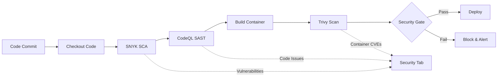

# SSD Exam Plan - CI/CD Pipeline Security

## Problem Statement

This project investigates how a CI/CD pipeline can be secured using automated analysis tools such as SNYK (Software Composition Analysis), CodeQL (Static Application Security Testing) and Trivy (Container Scanning). The goal is to identify vulnerabilities during the build process and assess how these security controls support the Cyber Resilience Act requirements for secure software development and supply-chain protection.

## Timeline

- **Problem Statement Approval**: Get teacher approval first
- **Project Work**: Complete before 5 Jan
- **Synopsis Submission**: 5 Jan before 12:00 (Wiseflow)
- **Presentation Preparation**: Ready 7-8 minute presentation
- **Exam**: 19-20 Jan (20 minutes total)

---

## Part 1: Theoretical Foundation

### 1.1 Cyber Resilience Act (CRA) Requirements

**Study Areas:**

- Essential cybersecurity requirements for products with digital elements
- Secure development lifecycle requirements
- Vulnerability management obligations
- Supply chain security requirements
- Documentation and transparency requirements

**Key Questions to Answer:**

- What are the CRA's requirements for secure software development?
- How does CRA mandate vulnerability handling in the software lifecycle?
- What supply chain security measures does CRA require?

### 1.2 CI/CD Security Fundamentals

**Concepts to Master:**

- CI/CD pipeline architecture and stages
- Security integration points in DevOps (DevSecOps)
- Shift-left security approach
- Security gates and policy enforcement
- Pipeline security best practices

### 1.3 Security Analysis Tools - Deep Dive

#### A) SNYK - Software Composition Analysis (SCA)

**Theory:**

- What is Software Composition Analysis?
- How does SNYK identify vulnerabilities in dependencies?
- Open source license compliance
- Dependency graph analysis
- Remediation strategies

**CRA Mapping:**

- How SCA supports CRA Article 13 (vulnerability handling)
- How it addresses supply chain transparency requirements
- SBOM (Software Bill of Materials) generation

#### B) CodeQL - Static Application Security Testing (SAST)

**Theory:**

- What is SAST and how does it work?
- CodeQL query language fundamentals
- Common vulnerability patterns (OWASP Top 10)
- Taint analysis and data flow
- False positive management

**CRA Mapping:**

- How SAST supports secure development requirements
- Code quality and security standards compliance
- Early vulnerability detection in development

#### C) Trivy - Container Scanning

**Theory:**

- Container security fundamentals
- Image vulnerability scanning
- Configuration scanning (IaC security)
- Multi-layer scanning approach
- Container best practices

**CRA Mapping:**

- Runtime environment security requirements
- Infrastructure security compliance
- Vulnerability disclosure obligations

---

## Part 2: Practical Implementation

### IMPORTANT: What You Need to Deliver

You must create **BOTH**:

1. **Actual Working Project** ✓

   - A real CI/CD pipeline implementation
   - Integrated SNYK, CodeQL, and Trivy
   - GitHub/GitLab repository with working code
   - Evidence of vulnerability detection

2. **Synopsis** ✓
   - Written document describing your project
   - Links to your repository
   - Screenshots and diagrams of your work

**The synopsis is NOT a theoretical paper - it documents your actual implementation!**

Evidence from exam requirements:

> "Synopsis should include... Link to source code repository and/or other artifacts created"

---

### Step-by-Step Project Creation Guide

## Phase 1: Setup (Day 1-2)

### 2.1 Choose Your Application

Pick a simple application to demonstrate the security pipeline. Options:

**Option A: Simple Node.js REST API** (Recommended for beginners)

- Easy to add vulnerable dependencies
- Good CodeQL support
- Simple to containerize

**Option B: Python Flask Application**

- Good for web vulnerabilities
- Easy dependency management
- Excellent tool support

**Option C: Java Spring Boot**

- Enterprise-grade example
- Complex dependency tree
- Comprehensive scanning

**Recommendation**: Start with Node.js for simplicity unless you have strong preferences.

### 2.2 Create Repository

```bash
# Create project directory
mkdir ssd-cicd-security-project
cd ssd-cicd-security-project

# Initialize Git
git init

# Create README
echo "# SSD CI/CD Security Project" > README.md
echo "Securing CI/CD pipeline with SNYK, CodeQL, and Trivy" >> README.md
```

**Create on GitHub:**

1. Go to https://github.com/new
2. Repository name: `ssd-cicd-security-project`
3. Description: "SSD Exam Project - CI/CD Security Pipeline"
4. Public or Private (your choice)
5. Don't initialize with README (you already have one)
6. Create repository

**Connect local to remote:**

```bash
# Add remote (adjust URL to your username)
git remote add origin https://github.com/YOUR-USERNAME/ssd-cicd-security-project.git
git branch -M main
git add .
git commit -m "Initial commit"
git push -u origin main
```

---

## Phase 2: Create Basic Application (Day 2-3)

### 2.3 Create Simple Node.js Application

**Step 1: Initialize Node.js project**

```bash
npm init -y
```

**Step 2: Install dependencies (including vulnerable ones for testing)**

```bash
# Install regular dependencies
npm install express

# Install OLD versions with known vulnerabilities (for testing)
npm install lodash@4.17.19
npm install axios@0.21.0
```

**Step 3: Create `app.js`**

```javascript
const express = require("express");
const app = express();
const port = 3000;

// Middleware
app.use(express.json());

// Intentional vulnerability #1: SQL Injection (for CodeQL)
app.get("/user/:id", (req, res) => {
  const userId = req.params.id;
  // UNSAFE: Direct string concatenation (SQL Injection)
  const query = "SELECT * FROM users WHERE id = " + userId;
  res.json({
    message: "User query",
    query: query,
    warning: "This is intentionally vulnerable for demonstration",
  });
});

// Intentional vulnerability #2: XSS (for CodeQL)
app.get("/search", (req, res) => {
  const searchTerm = req.query.q;
  // UNSAFE: Reflecting user input without sanitization
  res.send(`<h1>Search results for: ${searchTerm}</h1>`);
});

// Intentional vulnerability #3: Sensitive data exposure
app.get("/config", (req, res) => {
  res.json({
    apiKey: "sk-1234567890abcdef", // UNSAFE: Hardcoded secret
    dbPassword: "admin123",
  });
});

// Safe endpoint
app.get("/health", (req, res) => {
  res.json({ status: "healthy" });
});

app.listen(port, () => {
  console.log(`Server running on port ${port}`);
});
```

**Step 4: Create `Dockerfile`**

```dockerfile
# Use older base image with vulnerabilities (for Trivy testing)
FROM node:14-alpine

# Create app directory
WORKDIR /app

# Copy package files
COPY package*.json ./

# Install dependencies
RUN npm install

# Copy application code
COPY . .

# Expose port
EXPOSE 3000

# Run application
CMD ["node", "app.js"]
```

**Step 5: Create `.dockerignore`**

```
node_modules
npm-debug.log
.git
.gitignore
README.md
```

**Step 6: Create `package.json` scripts**

```bash
# Add to package.json scripts section
npm pkg set scripts.start="node app.js"
npm pkg set scripts.test="echo \"No tests yet\""
```

**Step 7: Test locally**

```bash
# Run the app
npm start

# In another terminal, test it
curl http://localhost:3000/health
```

**Step 8: Commit the application**

```bash
git add .
git commit -m "Add basic Node.js application with intentional vulnerabilities"
git push
```

---

## Phase 3: CI/CD Pipeline Setup (Day 3-5)

### 2.4 Create GitHub Actions Workflow

**Step 1: Create workflow directory**

```bash
mkdir -p .github/workflows
```

**Step 2: Create complete security pipeline**

Create `.github/workflows/security-pipeline.yml`:

```yaml
name: Security CI/CD Pipeline

on:
  push:
    branches: [main, develop]
  pull_request:
    branches: [main]

jobs:
  security-analysis:
    name: Security Analysis and Scanning
    runs-on: ubuntu-latest

    permissions:
      contents: read
      security-events: write
      actions: read

    steps:
      # Step 1: Checkout code
      - name: Checkout repository
        uses: actions/checkout@v3

      # Step 2: Set up Node.js
      - name: Set up Node.js
        uses: actions/setup-node@v3
        with:
          node-version: "18"

      - name: Install dependencies
        run: npm install

      # ============================================
      # SNYK - Software Composition Analysis (SCA)
      # ============================================
      - name: Run SNYK to check for vulnerabilities
        uses: snyk/actions/node@master
        continue-on-error: true
        env:
          SNYK_TOKEN: ${{ secrets.SNYK_TOKEN }}
        with:
          args: --severity-threshold=low --json-file-output=snyk-report.json

      - name: Upload SNYK report
        uses: actions/upload-artifact@v3
        if: always()
        with:
          name: snyk-report
          path: snyk-report.json

      # ============================================
      # CodeQL - Static Application Security Testing (SAST)
      # ============================================
      - name: Initialize CodeQL
        uses: github/codeql-action/init@v2
        with:
          languages: javascript
          queries: security-and-quality

      - name: Perform CodeQL Analysis
        uses: github/codeql-action/analyze@v2
        with:
          category: "/language:javascript"

      # ============================================
      # Build Docker Image
      # ============================================
      - name: Set up Docker Buildx
        uses: docker/setup-buildx-action@v2

      - name: Build Docker image
        run: |
          docker build -t myapp:${{ github.sha }} .
          docker save myapp:${{ github.sha }} -o myapp.tar

      # ============================================
      # Trivy - Container Vulnerability Scanning
      # ============================================
      - name: Run Trivy vulnerability scanner
        uses: aquasecurity/trivy-action@master
        with:
          image-ref: "myapp:${{ github.sha }}"
          format: "sarif"
          output: "trivy-results.sarif"
          severity: "CRITICAL,HIGH,MEDIUM,LOW"

      - name: Upload Trivy results to GitHub Security tab
        uses: github/codeql-action/upload-sarif@v2
        if: always()
        with:
          sarif_file: "trivy-results.sarif"
          category: "trivy-container-scan"

      - name: Run Trivy for JSON report
        uses: aquasecurity/trivy-action@master
        with:
          image-ref: "myapp:${{ github.sha }}"
          format: "json"
          output: "trivy-report.json"

      - name: Upload Trivy JSON report
        uses: actions/upload-artifact@v3
        if: always()
        with:
          name: trivy-report
          path: trivy-report.json

      # ============================================
      # Security Gate Summary
      # ============================================
      - name: Security Scan Summary
        if: always()
        run: |
          echo "=== Security Pipeline Completed ==="
          echo "✓ SNYK: Dependency scanning completed"
          echo "✓ CodeQL: Static code analysis completed"
          echo "✓ Trivy: Container scanning completed"
          echo ""
          echo "Check the Security tab for detailed results"
```

**Step 3: Commit the workflow**

```bash
git add .github/workflows/security-pipeline.yml
git commit -m "Add comprehensive security CI/CD pipeline"
git push
```

---

## Phase 4: Tool Configuration (Day 5-7)

### 2.5 Configure SNYK

**Step 1: Create SNYK account**

1. Go to https://snyk.io
2. Sign up with GitHub account
3. Authorize SNYK to access your repositories

**Step 2: Get API token**

1. Go to Account Settings: https://app.snyk.io/account
2. Click "General" → "Auth Token"
3. Copy your token

**Step 3: Add token to GitHub**

1. Go to your GitHub repository
2. Settings → Secrets and variables → Actions
3. Click "New repository secret"
4. Name: `SNYK_TOKEN`
5. Value: [paste your token]
6. Click "Add secret"

**Step 4: Test SNYK locally (optional)**

```bash
# Install SNYK CLI
npm install -g snyk

# Authenticate
snyk auth

# Test your project
snyk test

# Monitor your project
snyk monitor
```

### 2.6 Configure CodeQL

**Step 1: Enable CodeQL in repository**

1. Go to repository Settings
2. Click "Code security and analysis"
3. Enable "CodeQL analysis"
4. Select language: JavaScript
5. Click "Set up this workflow"

**Note**: Your workflow file already includes CodeQL, so GitHub will detect it automatically.

**Step 2: Enable Dependabot (bonus)**

1. Same page: "Code security and analysis"
2. Enable "Dependabot alerts"
3. Enable "Dependabot security updates"

### 2.7 Configure Trivy

**No additional setup needed!** Trivy is integrated in the GitHub Actions workflow.

**Optional: Test Trivy locally**

```bash
# Install Trivy (macOS)
brew install trivy

# Build your image
docker build -t myapp:test .

# Scan the image
trivy image myapp:test

# Scan with specific severity
trivy image --severity HIGH,CRITICAL myapp:test
```

---

## Phase 5: Test and Validate (Day 7-9)

### 2.8 Trigger the Pipeline

**Step 1: Push a change to trigger the pipeline**

```bash
# Make a small change
echo "# Testing pipeline" >> README.md
git add README.md
git commit -m "Test security pipeline"
git push
```

**Step 2: Monitor the pipeline**

1. Go to your repository on GitHub
2. Click "Actions" tab
3. Watch your workflow run
4. All three security scans should execute

### 2.9 Review Results

**Check SNYK results:**

1. Actions tab → Click your workflow run
2. Look for "Run SNYK to check for vulnerabilities"
3. Download the artifact "snyk-report"
4. You should see vulnerabilities in lodash@4.17.19 and axios@0.21.0

**Check CodeQL results:**

1. Go to repository "Security" tab
2. Click "Code scanning alerts"
3. You should see alerts for:
   - SQL injection in `/user/:id`
   - XSS vulnerability in `/search`
   - Hardcoded credentials in `/config`

**Check Trivy results:**

1. Security tab → "Code scanning alerts"
2. Filter by "trivy-container-scan"
3. You should see vulnerabilities in the Node.js base image

### 2.10 Take Screenshots

**Capture evidence for your synopsis:**

1. **Pipeline execution:**

   - Screenshot of successful workflow run
   - Screenshot showing all three tools executing

2. **SNYK findings:**

   - Dashboard showing vulnerable dependencies
   - Specific vulnerability details (lodash, axios)
   - SNYK recommendations for fixes

3. **CodeQL findings:**

   - Code scanning alerts page
   - SQL injection alert details
   - XSS vulnerability details
   - Hardcoded secret detection

4. **Trivy findings:**

   - Container scan results
   - Critical/High vulnerabilities in base image
   - Detailed vulnerability information

5. **Security dashboard:**
   - Overall security overview
   - All alerts consolidated

Save all screenshots in a `docs/screenshots/` folder in your repository.

---

## Phase 6: Documentation (Day 9-11)

### 2.11 Create Architecture Diagram

Create a diagram showing your pipeline flow. Tools you can use:

- Draw.io (https://app.diagrams.net/)
- Excalidraw (https://excalidraw.com/)
- Lucidchart
- Mermaid (text-based in Markdown)

**Example Mermaid diagram** (add to README.md):

````markdown

````

### 2.12 Update README.md

Create comprehensive documentation:

```markdown
# SSD CI/CD Security Project

Securing CI/CD pipelines with automated security analysis tools.

## Overview

This project demonstrates how to integrate security tools (SNYK, CodeQL, Trivy) into a CI/CD pipeline to comply with Cyber Resilience Act requirements.

## Tools Used

- **SNYK**: Software Composition Analysis (SCA) for dependency vulnerabilities
- **CodeQL**: Static Application Security Testing (SAST) for code vulnerabilities
- **Trivy**: Container image scanning for runtime vulnerabilities

## Pipeline Architecture

[Include your diagram here]

## Security Findings

### SNYK Results

- Detected X vulnerabilities in dependencies
- Critical: Y, High: Z

### CodeQL Results

- Detected X code security issues
- SQL Injection, XSS, Hardcoded secrets

### Trivy Results

- Detected X container vulnerabilities
- Base image vulnerabilities identified

## CRA Compliance Mapping

| CRA Requirement          | Implementation                   |
| ------------------------ | -------------------------------- |
| Secure Development       | CodeQL SAST in pipeline          |
| Vulnerability Management | SNYK + Trivy continuous scanning |
| Supply Chain Security    | SNYK dependency analysis + SBOM  |

## Repository Structure
```

.
├── .github/
│ └── workflows/
│ └── security-pipeline.yml
├── docs/
│ ├── screenshots/
│ └── architecture/
├── app.js
├── Dockerfile
├── package.json
└── README.md

````

## Running Locally

```bash
npm install
npm start
````

## Running Security Scans

Scans run automatically on push/PR. To run locally:

```bash
# SNYK
snyk test

# Docker build
docker build -t myapp .

# Trivy scan
trivy image myapp
```

## License

MIT

````

### 2.13 Create Project Structure

Organize your repository:

```bash
# Create documentation structure
mkdir -p docs/screenshots
mkdir -p docs/architecture
mkdir -p docs/reports

# Move/organize screenshots
# (copy your screenshots to docs/screenshots/)

# Create CRA mapping document
touch docs/cra-mapping.md
````

**Create `docs/cra-mapping.md`:**

```markdown
# Cyber Resilience Act Compliance Mapping

## Overview

This document maps our security pipeline implementation to CRA requirements.

## Mapping Table

| CRA Article | Requirement                | Tool         | Implementation      | Status |
| ----------- | -------------------------- | ------------ | ------------------- | ------ |
| Art. 10     | Secure development process | CodeQL       | SAST in CI/CD       | ✓      |
| Art. 13     | Vulnerability handling     | SNYK + Trivy | Automated scanning  | ✓      |
| Art. 13     | Timely updates             | Dependabot   | Automated PRs       | ✓      |
| SBOM        | Supply chain transparency  | SNYK         | Dependency mapping  | ✓      |
| Art. 11     | Security by default        | All tools    | Shift-left approach | ✓      |

## Detailed Analysis

### Secure Development (Article 10)

- **Requirement**: Products must be developed securely
- **Implementation**: CodeQL performs SAST on every commit
- **Evidence**: [Link to CodeQL alerts]

### Vulnerability Management (Article 13)

- **Requirement**: Handle vulnerabilities throughout lifecycle
- **Implementation**:
  - SNYK scans dependencies
  - Trivy scans runtime environment
  - Automated alerts and remediation
- **Evidence**: [Link to security findings]

[Continue for each requirement...]
```

---

## Suggested Timeline

| Days          | Phase         | Tasks                                                   |
| ------------- | ------------- | ------------------------------------------------------- |
| **Day 1-2**   | Setup         | Create repo, choose app, get problem statement approved |
| **Day 3**     | Development   | Create basic Node.js app with vulnerabilities           |
| **Day 4-5**   | Pipeline      | Implement GitHub Actions workflow                       |
| **Day 6**     | Configuration | Set up SNYK, CodeQL, Trivy                              |
| **Day 7**     | Testing       | Run pipeline, verify all tools work                     |
| **Day 8-9**   | Documentation | Screenshots, diagrams, README                           |
| **Day 10-11** | Synopsis      | Write synopsis document                                 |
| **Day 12-14** | Presentation  | Create slides, practice                                 |
| **Jan 5**     | Deadline      | Submit synopsis before 12:00                            |

---

## Project Structure Example

Your final repository should look like:

```
ssd-cicd-security-project/
├── .github/
│   └── workflows/
│       └── security-pipeline.yml
├── docs/
│   ├── screenshots/
│   │   ├── snyk-findings.png
│   │   ├── codeql-alerts.png
│   │   ├── trivy-results.png
│   │   └── pipeline-run.png
│   ├── architecture/
│   │   └── pipeline-diagram.png
│   ├── reports/
│   │   ├── snyk-report.json
│   │   └── trivy-report.json
│   └── cra-mapping.md
├── src/
│   └── app.js
├── .dockerignore
├── .gitignore
├── Dockerfile
├── package.json
├── package-lock.json
└── README.md
```

---

## Part 3: CRA Compliance Analysis

### 3.1 Mapping Tools to CRA Requirements

**Create a table showing:**

| CRA Requirement            | SNYK | CodeQL | Trivy | Implementation    |
| -------------------------- | ---- | ------ | ----- | ----------------- |
| Secure development process | ✓    | ✓      | ✓     | [How implemented] |
| Vulnerability management   | ✓    | ✓      | ✓     | [How implemented] |
| Supply chain security      | ✓    |        | ✓     | [How implemented] |
| SBOM generation            | ✓    |        | ✓     | [How implemented] |
| Vulnerability disclosure   | ✓    | ✓      | ✓     | [How implemented] |

### 3.2 Gap Analysis

**Identify:**

- What CRA requirements are fully covered?
- What requirements are partially covered?
- What additional controls are needed?
- What manual processes remain?

### 3.3 Benefits and Limitations

**Analyze:**

- **Benefits**: Early detection, automation, compliance evidence, etc.
- **Limitations**: False positives, tool coverage gaps, performance impact, etc.
- **Recommendations**: How to improve the security pipeline

---

## Part 4: Synopsis Structure

### Cover Page

- Title: "Securing CI/CD Pipeline with Automated Analysis Tools: A CRA Compliance Approach"
- Your full name(s)
- Date

### Problem Statement

- Copy the approved problem statement

### Project Overview (2-3 pages)

1. **Introduction**

   - Context: Why CI/CD security matters
   - Scope: What you implemented
   - Agramkow case connection

2. **Theoretical Foundation**

   - Brief overview of CRA requirements
   - SCA, SAST, and container scanning concepts
   - DevSecOps principles

3. **Implementation**

   - Pipeline architecture diagram
   - Tool integration approach
   - Configuration highlights

4. **Results and Analysis**

   - Example vulnerabilities detected
   - Tool effectiveness comparison
   - CRA compliance mapping

5. **Conclusion**
   - Key findings
   - Recommendations
   - Limitations and future work

### Diagrams and Models

- CI/CD pipeline architecture
- Security gate flow diagram
- CRA compliance mapping table
- Tool comparison matrix

### Repository Link

- GitHub/GitLab repository URL
- Access instructions if needed

---

## Part 5: Presentation Preparation (7-8 minutes)

### Presentation Structure

**Slide 1: Title & Introduction (30 seconds)**

- Project title
- Your name
- Quick hook: "Why CI/CD security matters"

**Slide 2: Problem Statement (45 seconds)**

- Read/explain the problem statement
- Context: Agramkow case and CRA

**Slide 3: Theoretical Background (1 minute)**

- What is CRA and why it matters
- Brief explanation of SCA, SAST, Container Scanning
- DevSecOps shift-left approach

**Slide 4: Solution Architecture (1.5 minutes)**

- Pipeline architecture diagram
- How the three tools integrate
- Security gates and workflow

**Slide 5: SNYK Implementation (1 minute)**

- What it does (dependency scanning)
- Demo: Show vulnerability detection
- CRA mapping

**Slide 6: CodeQL Implementation (1 minute)**

- What it does (code analysis)
- Demo: Show code vulnerability detection
- CRA mapping

**Slide 7: Trivy Implementation (1 minute)**

- What it does (container scanning)
- Demo: Show container vulnerabilities
- CRA mapping

**Slide 8: Results & CRA Compliance (1.5 minutes)**

- Key findings and metrics
- Compliance mapping table
- Benefits achieved

**Slide 9: Conclusion & Recommendations (30 seconds)**

- Summary of achievements
- Limitations and future improvements
- Final thoughts

### Demonstration Tips

- Have repository ready to show if needed
- Prepare screenshots/screen recordings
- Practice timing (stay within 7-8 minutes)
- Be ready to dive deeper into any area

---

## Part 6: Exam Question Preparation

### Expected Questions on Your Project

1. Why did you choose these specific tools?
2. How do the tools complement each other?
3. What vulnerabilities did you find during testing?
4. How do false positives affect the pipeline?
5. What are the performance implications?
6. How does this address CRA requirements specifically?
7. What would you do differently in a production environment?
8. How do you handle vulnerability remediation workflow?

### General SSD Course Topics to Review

- Threat modeling methodologies
- OWASP Top 10 vulnerabilities
- Secure SDLC practices
- Security testing types (SAST, DAST, IAST, SCA)
- Container security best practices
- Supply chain attacks and mitigations
- Security standards and frameworks
- Risk assessment and management

---

## Part 7: Checklist

### Before Starting

- [ ] Read and understand CRA requirements
- [ ] Get problem statement approved by teacher
- [ ] Set up development environment
- [ ] Choose sample application/repository

### Implementation Phase

- [ ] Set up CI/CD pipeline
- [ ] Integrate SNYK for dependency scanning
- [ ] Integrate CodeQL for SAST
- [ ] Integrate Trivy for container scanning
- [ ] Test each tool individually
- [ ] Create complete integrated pipeline
- [ ] Document all configurations
- [ ] Collect screenshots and evidence

### Analysis Phase

- [ ] Map tools to CRA requirements
- [ ] Analyze tool effectiveness
- [ ] Document findings and results
- [ ] Create diagrams and charts
- [ ] Identify limitations and improvements

### Synopsis Writing

- [ ] Create cover page
- [ ] Write all required sections
- [ ] Include all diagrams and models
- [ ] Add repository link
- [ ] Proofread and format
- [ ] Submit before deadline (5 Jan 12:00)

### Presentation Preparation

- [ ] Create presentation slides
- [ ] Prepare demonstrations
- [ ] Practice timing (7-8 minutes)
- [ ] Prepare for Q&A
- [ ] Review general course topics

---

## Resources

### Official Documentation

- [SNYK Documentation](https://docs.snyk.io/)
- [CodeQL Documentation](https://codeql.github.com/docs/)
- [Trivy Documentation](https://aquasecurity.github.io/trivy/)
- [Cyber Resilience Act Text](https://digital-strategy.ec.europa.eu/en/policies/cyber-resilience-act)

### Learning Resources

- GitHub Actions for CI/CD
- DevSecOps best practices
- Container security guides
- OWASP resources

### Example Projects

- Search GitHub for "devsecops pipeline"
- Look for security pipeline templates
- Review sample CodeQL queries

---

## Tips for Success

1. **Start Early**: Don't wait until the last minute
2. **Document Everything**: Take screenshots as you go
3. **Keep It Practical**: Focus on working implementation, not perfect theory
4. **Test Thoroughly**: Make sure each tool actually catches vulnerabilities
5. **Connect to CRA**: Always link back to compliance requirements
6. **Be Honest**: Acknowledge limitations and tradeoffs
7. **Practice Presentation**: Time yourself multiple times
8. **Understand, Don't Memorize**: Be ready to explain your choices

Good luck with your exam! 🎓
